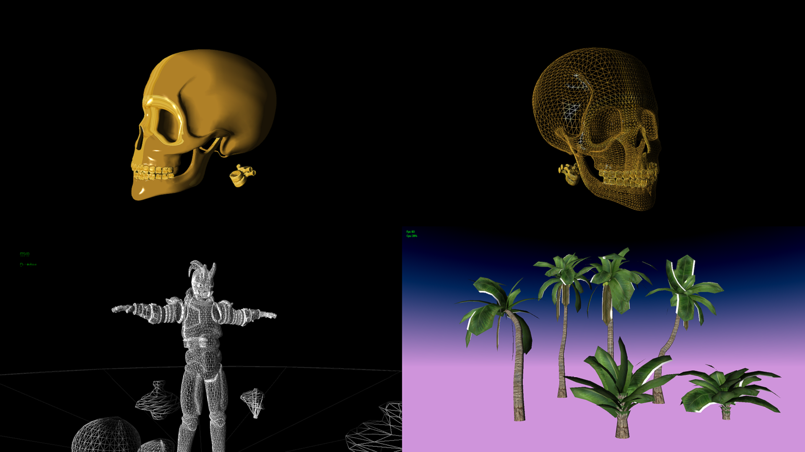
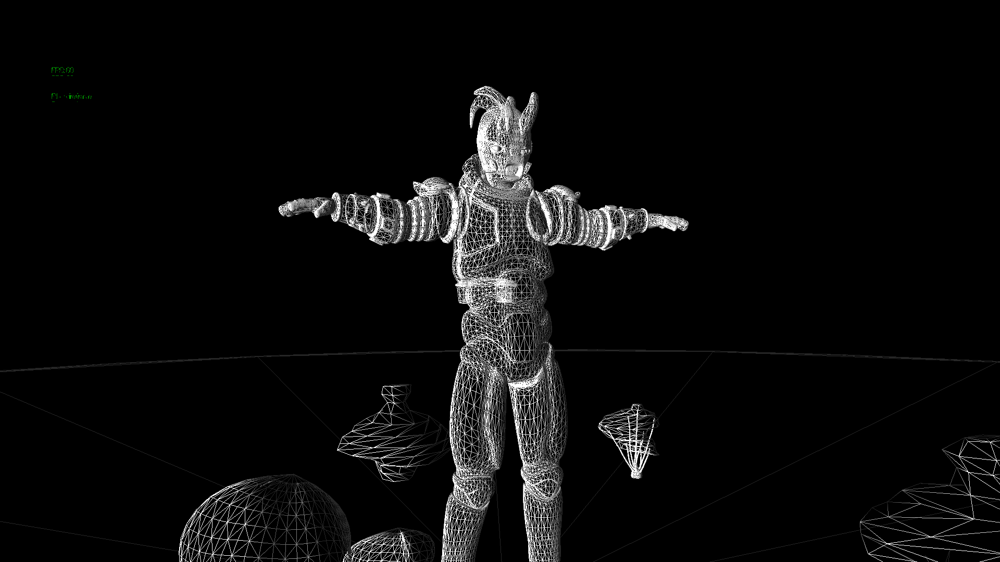

# My simple project
My simple project where I am getting started with rendering pipeline using DirectX SDK. Currently my knowledge in this is not so good so project is expanding only with tutorials help.
This project is based on [Rastertek's tutorials](http://www.rastertek.com).

## Dependencies ##
* [Assimp v3.3.1](http://assimp.org/) [(Source)](https://github.com/assimp/assimp)

### Current progress showcase:

## HM1
### 1.
func number  
&nbsp; &nbsp; &nbsp; | number == 0 = []  
&nbsp; &nbsp; &nbsp; | otherwise = mod number 10 : func (div number 10)  
### 2.
func word  
&nbsp; &nbsp; &nbsp; | length word <= 1 = True  
&nbsp; &nbsp; &nbsp; | head word /= last word = False  
&nbsp; &nbsp; &nbsp; | otherwise = func (init(tail word))  
### 3.
max [x] = x  
max (x:xs)   
&nbsp; &nbsp; &nbsp; | x > maxTail = x  
&nbsp; &nbsp; &nbsp; | otherwise = maxTail  
&nbsp; &nbsp; where maxTail = max xs  
### 4.
func num  
&nbsp; &nbsp; &nbsp; | num == 2 = True  
&nbsp; &nbsp; &nbsp; | mod num 2 == 0 = func(div num 2)  
&nbsp; &nbsp; &nbsp; | otherwise = False  

## HM2
### 1. ZipWith
zipWith _ [] _ = []  
zipWith _ _ [] = []  
zipWith f (a:as) (b:bs) = [f a b] ++ zipWith f as bs  
sum a b = a + b  
### 2. Flip
flip f a b = f a b  
sum a b = a + b  
### 3. Map
map _ [] = []  
map f (a:as) = [f a] ++ map f as  
sum a b = a + b  
### 4. Filter
filter _ [] = []  
filter f (a:as)   
&nbsp; &nbsp; &nbsp; | f a == True = [a] ++ filter f as  
&nbsp; &nbsp; &nbsp; | otherwise = filter f as  
isOdd a  
&nbsp; &nbsp; &nbsp; | rem a 2 /= 0 = True  
&nbsp; &nbsp; &nbsp; | otherwise = False  
